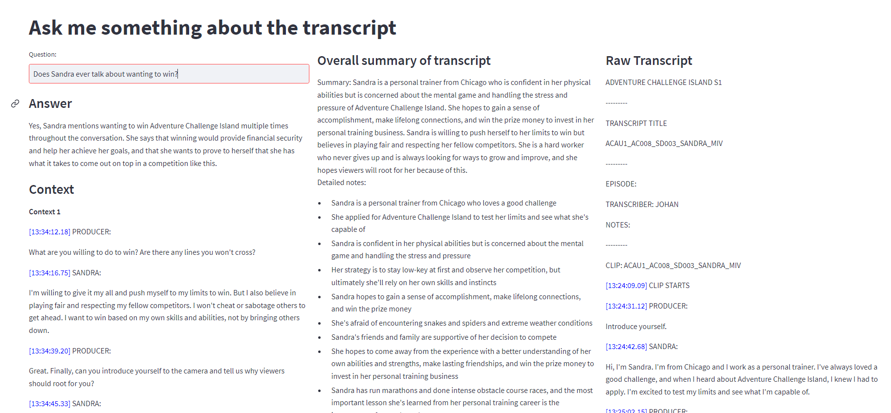

# Reality Public

This repository contains a Streamlit app that allows users to interact with transcripts of reality TV shows. Specifically, the app provides a summary of the transcript and allows the user to ask questions about it.



## Requirements

To run the app, you will need Python 3.7 or later and the packages listed in `requirements.txt`. You can install these packages using pip:

"""bash
pip install -r requirements.txt
"""

## Usage

To use the app, you need to follow these steps:

1. Put a transcript file in the `transcripts` folder. The transcript should be in plain text format, with one sentence per line. The file name should have the format `show_season_episode.txt`. For example, if you have a transcript of the first episode of "Survivor" season 1, the file name should be `survivor_1_1.txt`.

2. Run `save_embeddings.py` to compute sentence embeddings for the transcript. This step requires the `sentence-transformers` package, which will be installed automatically if you run `pip install -r requirements.txt`. The embeddings will be saved in the `embeddings` folder.

```bash
python save_embeddings.py
```

3. Run `save_summaries.py` to compute a summary of the transcript. This step requires the `sumy` package, which will also be installed automatically. The summary will be saved in the `summaries` folder.

```bash
python save_summaries.py
```

4. Finally, run `app.py` to launch the Streamlit app. You can do this by running:

```bash
streamlit run app.py
```

The app will open in your default web browser.

## How to ask questions

Once you have the app running, you can enter a question in the text box and click the "Ask" button. The app will then search the transcript for the answer to your question and display it on the screen.

Here are some examples of questions you can ask:

- "What does Sandra say about wanting to win?"
- "Who does John say is his biggest competition?"
- "What does Mary say about the food on the island?"

Note that the app uses a simple keyword-based search to find the answer to your question. It may not always be able to find the exact answer you are looking for.

## License

This code is licensed under the MIT License. See the LICENSE file for more information.
